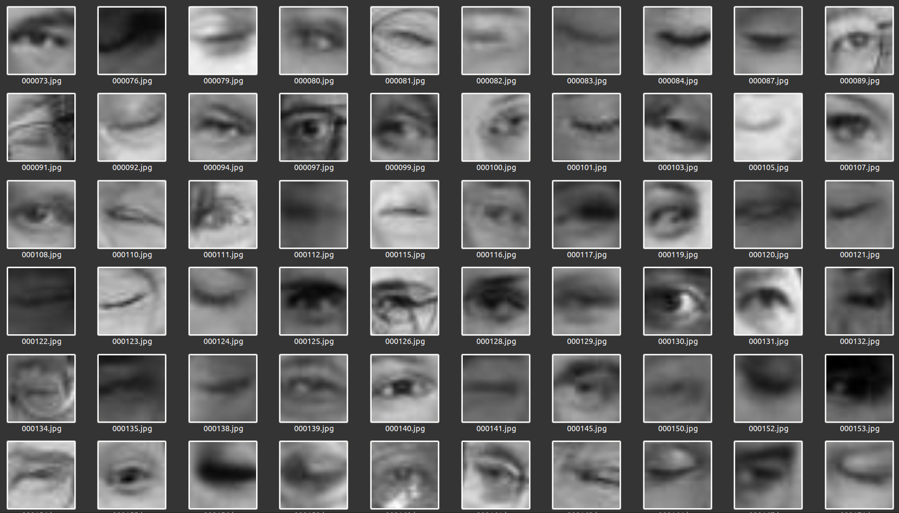
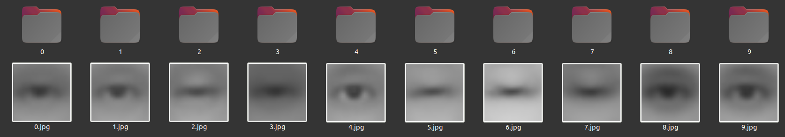
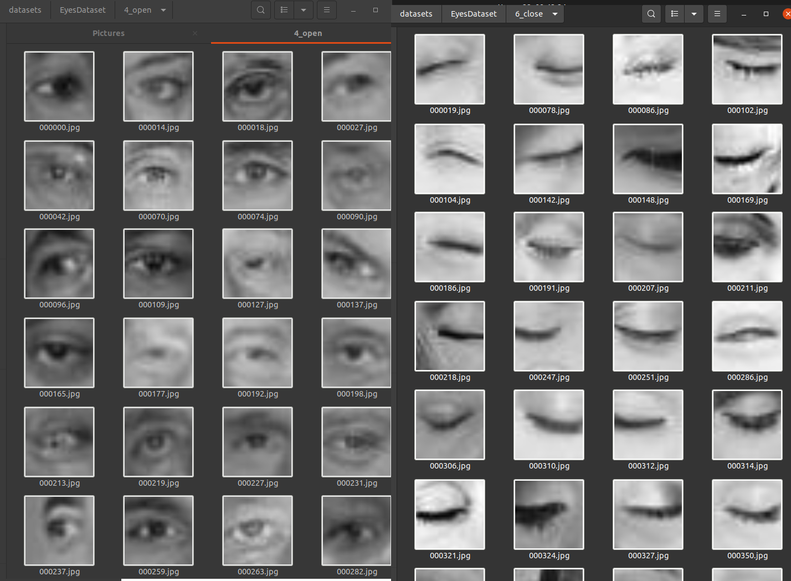
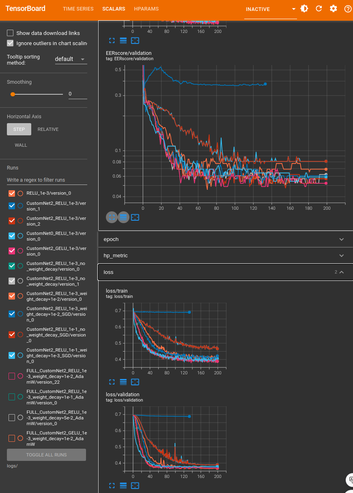
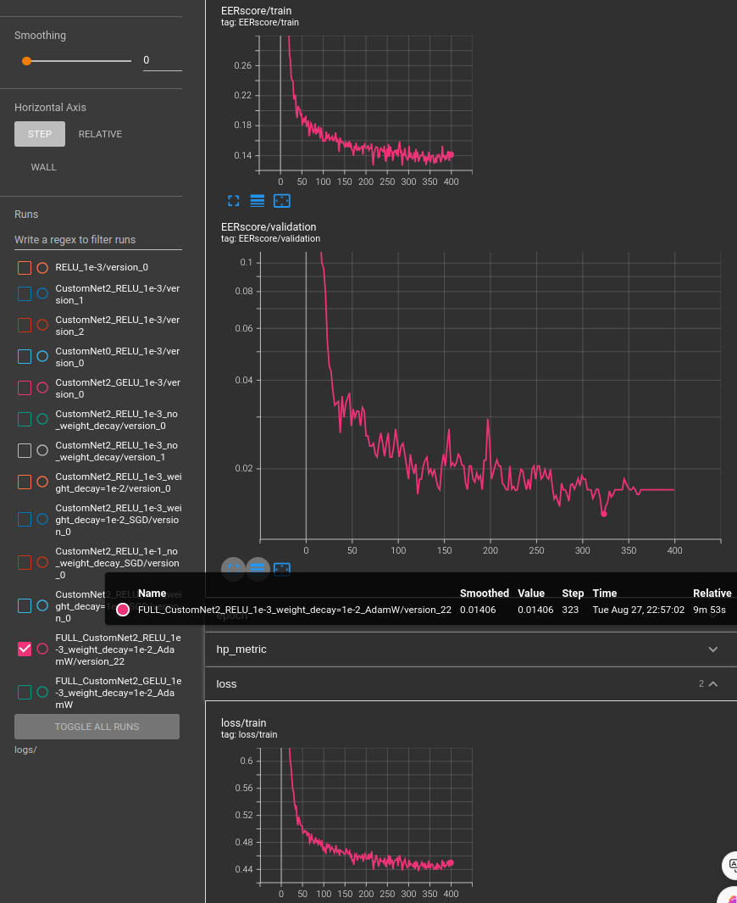

## ПЕРВИЧНАЯ РАБОТА С ДАННЫМИ

В рамках текущей задачи требовалось разработать классификатор открытых\закрытых глаз на основе предоставленных данных (
4000 кадров). 

*Рис 1. Пример данных.*

Для начала работы, требуется как-то разделить изображения по классам, на которых можно обучать классификатор. Для этой
задачи воспользуемся репозиторием https://github.com/idealo/imagededup, в котором присутствует предобученная сверточная
сеть, способная находить похожие изображения.
Немного модифицируем пайплайн, чтобы не просто отсеивать дубликаты, а кластеризовать изображения на n частей. Для
облегчения составления подвыборки, разобьем все изображения на 10 кластеров и получим “среднее изображение” каждого
кластера.

*Рис 2. Сортированные по папкам изображения и их “среднее изображение”.*

На рисунке выше можно примерно оценить, какие данные находятся в папке. Так, например, для старта кажутся очень
отчетливыми 4,6 папки. Рассмотрим их содержание.

*Рис 3. Пример кластеризованных изображений.*

Исправив несколько ошибок, после такого простого разделения данных, приступим непосредственно к задаче обучения
классификатора. Таким образом удалось получить 750 изображений закрытых и 710 открытых глаз, которые далее были разбиты
на train\val части.

## РАЗРАБОТКА КЛАССИФИКАТОРА

Так как по условию задачи должен быть именно классификатор, то на выходе НС должно быть 2 нейрона по числу
классов: `[0:закрытый глаз, 1:открытый глаз]`

В качестве классификатора было решено взять сверточную нейросеть. Проектировать и обучать её будем с помощью фреймворка
pytorch.

Так как мы обучаем классификатор, то в качестве функции потерь будем использовать **CrossEntopyLoss**. Также по условию
задачи, качество работы будет оцениваться с помощью *метрики EER*, то выбирать лучшую НС по качеству будем с помощью
реализованной с помощью torchmetrics этой же
метрики https://github.com/IamSVP94/open-closed_eyes_classifier/blob/main/src/utils_pl.py#L140

Так как метрика учитывает не просто принадлежность к классу, а еще и вероятность, то регулируя значение регуляризации
weight decay, мы можем регулировать плавность перехода между классами. В процессе решения задачи, были испытаны разные
конфигурации сетей, количество слоев и нейронов в них, функции активации между слоями, и видов оптимайзера и в конечном
итоге по качеству лучше всех себя показала следующая конфигурация с функцией активации RELU.

*Рис 4. Графики обучения разных версий НС.*

## РАЗМЕТКА ОСТАВШЕГОСЯ ДАТАСЕТА

С помощью получившейся НС, мы можем разметить все оставшиеся данные (сделать псевдолеблинг.) После разметки, будем
использовать эти данные в качестве train выборки, а предыдущие размеченные данные, как val.

## ИТОГОВЫЙ РЕЗУЛЬТАТ И РАСЧЕТ МЕТРИК

*Рис 5. Графики обучения НС на полном датасете.*

Так как мы использовали все данные для обучения, то ограничимся рассчетом метрик на валидационном датасете, с помощью
специального скрипта: https://github.com/IamSVP94/open-closed_eyes_classifier/blob/main/get_metric_score.py

По заданию, нужно было предоставить класс `OpenEyesClassificator` c методами `__init__(self)` (где инициализируется и
загружается модель) и метода `predict(self, inpIm)`, где `inpIm` - полный путь к изображению глаза, который возвращает
`is_open_score` - float score классификации от 0.0 до 1.0 (где 1 - открыт, 0 - закрыт). Этот класс лежит по
адресу https://github.com/IamSVP94/open-closed_eyes_classifier/blob/main/output_script.py 